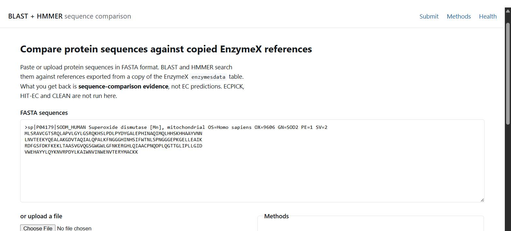
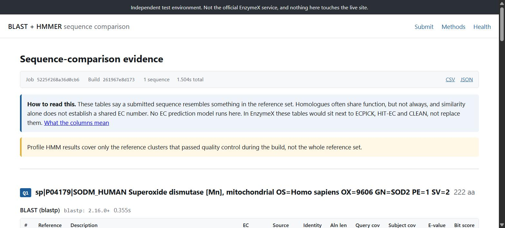
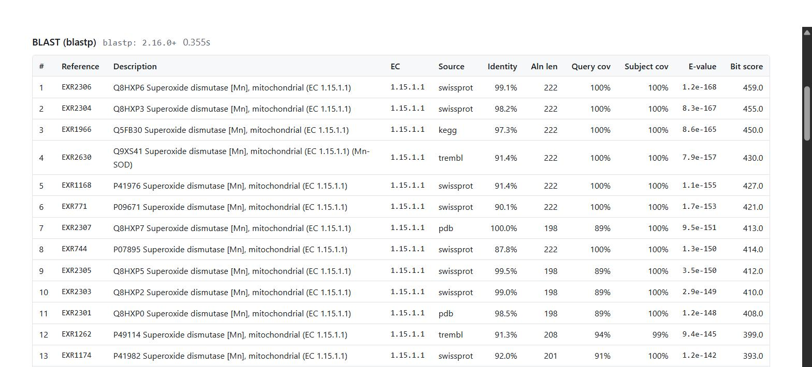
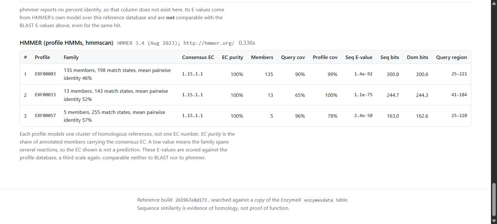
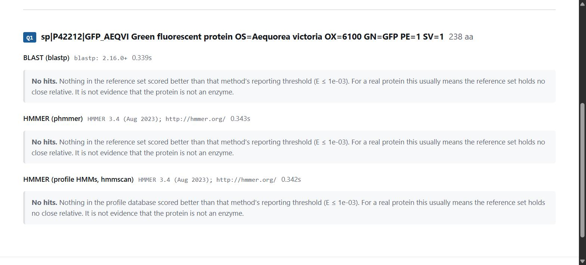

# Handoff

Final state of the standalone BLAST/HMMER test server, verified end to end
after the Swiss-Prot/PDB source-policy rebuild on 2026-07-31 UTC. Everything
below was re-run from a clean `var/` on this commit.

> Independent test environment. Not the official EnzymeX codebase, nothing was
> pushed at the EnzymeX repository, and no EnzymeX service was touched.

Audited: fresh-clone setup, the full test suite, a reference rebuild from a
copied MySQL database, a positive and a negative query through the browser, and
whether the numbers on the results page actually belong to the reference record
they are printed next to. Findings and fixes are at the end.

---

## 1. Setup

Ubuntu 24.04 (WSL2 here). Needs `micromamba`/`mamba`/`conda` on PATH; the
setup script installs micromamba to `~/.local/bin` if none is found.

```bash
git clone <repo> blast-hmmer-datax && cd blast-hmmer-datax
bash scripts/00_setup.sh          # micromamba + BLAST+ / HMMER / MAFFT / MMseqs2
cp .env.example .env
$EDITOR .env                      # DB credentials, ENZYMEX_DB_CONFIRM_COPY=true
```

`make` runs every recipe inside the `blast-hmmer-datax` environment, so no
`activate` step is needed. Verify the toolchain:

```bash
make versions
```

Recorded here: blastp/makeblastdb 2.16.0+, HMMER 3.4, MAFFT v7.526,
MMseqs2 18.8cc5c, Python 3.12.13, DIAMOND 2.2.4 (optional, proof of concept only).

### Copied database

Production is never a valid target. `ENZYMEX_DB_CONFIRM_COPY=true` is required
before the build will open a connection.

```sql
CREATE USER 'enzymex_ro'@'%' IDENTIFIED BY '<password>';
GRANT SELECT ON enzymex_copy.* TO 'enzymex_ro'@'%';
```

Without EnzymeX access there is no copy, so a local stand-in with the same
schema is used. Full commands are in
[`docs/database.md`](docs/database.md#local-fixture-database-development-only);
in short:

```bash
micromamba create -y -n mysql-fixture -c conda-forge mysql-server
# initialise + start mysqld on :3307, create enzymex_copy and enzymex_ro
python scripts/dev_seed_fixture.py --port 3307 --user root --password ""
```

That loads 2,677 rows from reviewed UniProtKB entries across twelve EC numbers,
plus 10 deliberately damaged rows, and writes a 111-sequence holdout to
`var/fixture/holdout_queries.fasta` that is excluded from the table.

## 2. Reference build

```bash
make inspect     # read-only characterisation of the copy, writes nothing
make refbuild    # export -> BLAST db -> cluster -> profile HMMs -> manifest
make status      # what is currently built
```

Individual stages: `make export`, `make blast`, `make hmmer`. To skip the
profile layer on a first large build: `enzymex-refbuild all --skip-profiles`
(BLAST and phmmer still cover every reference).

## 3. Running the server

```bash
make serve                        # 127.0.0.1:8000, reload
make serve-prod                   # 0.0.0.0:8000, 2 workers, no reload
make health                       # pretty-printed /health
```

Docker Compose and systemd are in [`docs/deployment.md`](docs/deployment.md):

```bash
docker compose -f deploy/docker-compose.yml up -d
sudo systemctl enable --now enzymex-blast-hmmer
```

`/health` returns `ok`, `degraded` (artifacts fine, copied database
unreachable) or `unavailable` (503). It never contains the password.

## 4. Build statistics

Build `32abd580b689`, 2026-07-31T04:48:17Z, 137.1 s total on WSL2 / Ubuntu
24.04, 4 build threads.

| | |
|---|---|
| rows read from `enzymesdata` | 2,677 |
| exported references | 1,574 |
| skipped | 1,103 |
| unselected source rows | 930 (770 TrEMBL, 160 KEGG) |
| duplicate sequences merged (kept as provenance) | 120 |
| other skips | 47 too_short, 2 excessive_ambiguity, 1 each null / empty / internal_stop / looks_like_nucleotide |
| sequence length | 30 to 1,861, mean 361.1 |
| with EC annotation | 1,574 |
| multi-EC records | 132 |
| canonical sources | swissprot 1,387, pdb 187 |

The fixture's PDB values are simulated provenance labels; every sequence in it
is genuinely Swiss-Prot. This build validates the Swiss-Prot/PDB selection and
deduplication code, not PDB ingestion or upstream provenance.

Profile layer:

| | |
|---|---|
| clusters (MMseqs2, 35% id / 80% bidirectional coverage) | 201 |
| accepted | 47 |
| rejected | 154, all `too_few_members` |
| profiles built | 47 (0 failed alignment or profile QC) |
| references covered by a profile | 1,352 of 1,574 (85.9%) |
| distinct consensus EC | 12 |
| mean EC purity | 0.9994 |
| match states | 143 to 917 |
| mean pairwise identity | median 0.5275, min 0.4082 |

Stage timings: export 1.0 s, `makeblastdb` 0.5 s, cluster + MAFFT + hmmbuild +
hmmpress 133.9 s. The profile layer is ~98% of the build.

**One EC can still give several profiles, as intended.** The 47 profiles carry
12 distinct consensus EC labels because clustering follows sequence family
rather than forcing every protein for one reaction into one alignment.

### Public Swiss-Prot/PDB build

The fixture proves the source-selection and deduplication code but contains no
PDB-derived record. `scripts/load_swissprot_pdb.py` loads the public
`SwissProt_PDB_2022` set from `datax-lab/HIT-EC` (273,500 rows) into a separate
`enzymex_real` database, joined on exact sequence against `datax-lab/IDF-EC` for
EC annotation. Both are Git LFS files, so they must be fetched from
`media.githubusercontent.com` or you get a 134-byte pointer. It is a proxy for
the copied EnzymeX table, not the table itself.

```bash
python scripts/load_swissprot_pdb.py --sequences SwissProt_PDB_2022.csv --ec dataset.csv
ENZYMEX_DB_NAME=enzymex_real enzymex-refbuild all --skip-profiles
```

Build `56b491bee73d`, 2026-08-01T00:28:34Z, `var/reference-real/`:

| | |
|---|---|
| rows read | 273,500 |
| exported references | 272,112 |
| skipped | 1,388 (1,256 too_short, 124 excessive_ambiguity, 8 too_long) |
| sources | swissprot 231,577, pdb 40,535 |
| with EC annotation | 235,821 |
| multi-EC records | 20,455 |
| sequence length | 30 to 8,903, mean 414.0 |
| duplicate sequences merged | 0 |
| export / `makeblastdb` / total | 252.2 s / 13.4 s / 268.7 s |
| BLAST database | 146.3 MB across 8 files |
| profiles | none, built with `--skip-profiles` |

Rows carrying both a Swiss-Prot accession and a PDB id (5,198 of them) are one
record with two identifiers, so the loader inserts them once as `swissprot` with
the PDB id kept in the description. Inventing a second row would manufacture
duplicate-merge statistics the source data does not support, which is why
`duplicate_sequences_merged` is 0 here and 120 on the fixture.

No code under `app/` changed for this build. The only new file is the loader.

Single-query timings on this generation, 2 search threads:

| | blastp | phmmer |
|---|---:|---:|
| human SOD2 | 1.797 s | 7.132 s |
| unrelated GFP | 1.579 s | 8.307 s |

**What real data exposed.** GFP is a clean negative on the fixture and not on
this build. It returns 25 blastp hits, top `EXR252478` (`6HR1`), 97.5% identity,
E 8.4e-175. All 25 are PDB entries, every one a fusion construct joining GFP to
an unrelated protein, and the 15 that carry an EC carry eight distinct ones,
none of which belong to GFP.

The output already flags it. The top hit has query coverage 1.00 against subject
coverage 0.546; across all 25, query coverage runs 0.97 to 1.00 while subject
coverage runs 0.27 to 0.84. That asymmetry is the fusion signature and it is
readable without opening PDB. It is also the payoff for merging HSP intervals to
compute subject coverage, since BLAST+ supplies no `scovs` field. This failure
mode cannot appear on the fixture, which holds no real PDB entry.

**The positive demo is a self-match here.** P04179 is present in this set, so
`data/demo/positive_sod2_human.fasta` returns itself at 100% identity and full
coverage. The held-out positive demo still requires the fixture build.

## 5. Test results

```bash
make test        # everything available
make test-unit   # no external tools, no database
make test-db     # needs ENZYMEX_DB_* pointing at a copy
```

| run | result |
|---|---|
| `make test`, no DB credentials exported | **170 passed, 13 skipped** (30.9 s) |
| `make test`, credentials exported | **183 passed, 0 skipped** (22.8 s) |

The 13 skips are the `mysql`-marked tests in `tests/test_database.py`; they run
only when `ENZYMEX_DB_PASSWORD` is in the environment. `tests/test_e2e.py`
builds a real BLAST database and a real profile HMM from the committed
27-sequence EC 1.1.1.1 dataset, so `make test` exercises the actual tools.

## 6. Demo inputs

Committed under `data/demo/`. Both are absent from the fixture reference set, so
against build `32abd580b689` neither can match itself. Neither property holds on
the public `56b491bee73d` build, so demo on the fixture.

**Positive** `data/demo/positive_sod2_human.fasta`: UniProt P04179, human
Superoxide dismutase [Mn], mitochondrial, 222 aa, EC 1.15.1.1. Chosen because
it is in the holdout set and because 1.15.1.1 is served by unrelated folds, so
it tests whether clustering separated them.

**Negative** `data/demo/negative_gfp.fasta`: UniProt P42212, *Aequorea
victoria* green fluorescent protein, 238 aa. Not an enzyme and unrelated to any
of the twelve reference EC families.

The proof-of-concept `data/raw/queries_negative.fasta` is an alpha-amylase. It
is negative against the 27-sequence EC 1.1.1.1 set only; against this reference
set it is a strong positive, which is why the demo does not use it.

## 7. Expected demo output

**Positive**, 0.93 s, all three methods:

* `blastp` 25 hits. Top: `EXR2306`, Q8HXP6 Superoxide dismutase [Mn]
  mitochondrial, EC 1.15.1.1, swissprot, 99.1% identity, 222 aa alignment,
  100% query and subject coverage, E 7.8e-169. Every one of the
  25 is EC 1.15.1.1.
* `phmmer` 25 hits, same top four references in the same order, no identity
  column, query region 1–222.
* `hmmscan` **exactly 2 profiles**: EXF00003 (90 members, E 1.3e-93) and
  EXF00027 (11 members, E 1.4e-72). Both have consensus EC 1.15.1.1 and 100%
  EC purity. **No Cu/Zn profile appears**, which is the correct result for a
  Mn-SOD query.

**Negative**, 0.85 s: "No hits" from all three methods, each quoting its own
threshold (E ≤ 1e-03), with the page stating that this means no detectable
relative in the reference set rather than "not an enzyme".

## 8. Screenshots

These screenshots predate the Swiss-Prot/PDB source-policy rebuild. The layout
and method states remain representative, but their build id and hit identifiers
are historical.

| | |
|---|---|
|  | `docs/screenshots/01-submission-page.jpg`: submission page with the positive query pasted |
|  | `02-results-header.jpg`: result header, job/build ids, CSV and JSON links, reading guidance |
|  | `03-results-blastp.jpg`: BLAST table |
|  | `04-results-hmmscan.jpg`: profile HMM table |
|  | `05-results-negative.jpg`: negative query, no hits from any method |

## 9. Verification performed

Beyond the automated suite, this handoff checked that the displayed values
belong to the record they are printed against. A clean pipeline with a wrong
mapping would pass every unit test.

1. **Every reference row against its source row.** All 1,574 `reference` rows
   in `metadata.sqlite3` re-checked against `enzymesdata` via `source_pk`:
   identifier derivation, normalised EC, normalised source, sequence SHA-256
   and length. **0 mismatches.**
2. **FASTA against metadata.** All 1,574 deflines and sequences in
   `references.fasta` checked against SQLite. **0 mismatches.** This is what
   makes `sseqid` a safe lookup key: `makeblastdb` runs without `-parse_seqids`,
   so BLAST returns the identifier byte-for-byte.
3. **Selected-source provenance.** All 120 `reference_duplicate` rows were
   checked against their source row as well. Every canonical and duplicate row
   is normalized to `swissprot` or `pdb`; eight exact-sequence groups promoted
   a later Swiss-Prot row over an earlier PDB row.
4. **Actual-tool positive and negative checks.** Human SOD2 returned 25 BLAST
   hits, 25 phmmer hits and 2 profile hits in 0.93 s total. Unrelated GFP
   returned no hits from all three methods in 0.85 s.
5. **Profile identity.** The current SOD profile metadata remains separated
   into two Mn/Fe-family profiles and three Cu/Zn-family profiles. A per-EC
   profile would have merged unrelated folds.
6. **HMMER coordinate normalisation.** The role flip between phmmer (query
   becomes the profile) and hmmscan (profile is the target) is covered in
   `app/search/parsers.py` and its parser tests.
7. **Example sequence.** The placeholder FASTA on the submission page is
   genuinely UniProt P00330 (yeast ADH1), byte-identical to UniProt and to the
   test fixture.
8. **Secrets and artifacts.** `git ls-files` shows no `.env`, no `var/`, no
   BLAST/DIAMOND index and no `.hmm`. `/health` reports
   `enzymex_ro@127.0.0.1:3307/enzymex_copy` and never the password.

## External fold validation for the source-policy build

The supplied Swiss-Prot fold was also validated independently. The split has
no accession or exact-sequence overlap, and BLAST 2.16 selected the same raw
top subject as the shared BLAST+ 2.5.0 output for all 452 sampled queries with
hits in both runs. For source-policy build `32abd580b689`, removing all 143
references matching a test sequence left 1,431 references. On the 349
truth-selected queries covered by those reference ECs, BLAST and phmmer had
87.68% and 86.82% top-hit EC overlap, while taking 7.8 s and 130.4 s. hmmscan
reached 97.49% only on the much narrower 279-query profile-covered slice.

This supports BLAST as the default sequence-evidence search, with profile HMMs
as optional family evidence. It does not support adding phmmer to every job
for nearly identical retrieval on this data. The full method, scope limits,
raw-artifact hashes and results are in
[`results/validation/fold_0_report.md`](results/validation/fold_0_report.md).

## 10. Known limitations

* Profile HMMs cover a QC-passing subset (85.9% here), never the whole
  reference set. The results page says so on every profile result.
* 154 of 201 clusters were rejected for having fewer than 5 members. On a
  larger copy that ratio will change; check `skipped_clusters.tsv` and
  `profile_member_coverage` before trusting the layer.
* `phmmer` is the slowest method and scales with reference count. First thing
  to need a raised timeout on a large copy.
* The profile layer is ~98% of the build and runs serially. It is parallelisable
  if it ever matters.
* Searches run synchronously behind a 2-slot semaphore; excess submissions get
  503 rather than queueing.
* No authentication, no rate limiting, no CSRF protection. Internal test server.
* Job results are files with 24-hour retention.
* E-values are not comparable across the three tables. The page repeats this;
  any port must keep doing so.
* The fixture's `source` labels are simulated. The public `56b491bee73d` build
  supplies genuine PDB provenance, but it is still a proxy; real provenance comes
  from the real copy.
* The 272,112-reference public build has no profile layer, so every `hmmscan`
  figure in these documents comes from the 1,574-reference fixture build.
  Building profiles on that generation is the next step, and
  `ENZYMEX_PROFILE_MIN_MEMBERS` should be reviewed before it runs.
* PDB fusion constructs let a query inherit an EC that belongs to the fusion
  partner. Coverage asymmetry exposes it on the page, but nothing rejects those
  hits automatically.
* `datax-lab/enzymex` was unreachable while this was built, so all UI and
  schema compatibility work is based on the documented column list and the live
  site and must be re-verified against the real codebase.
* `live_settings` in `tests/conftest.py` is currently unused. Left in place
  rather than removed as part of this audit.

## 11. Modules to transfer into EnzymeX

Portable as-is. None of these import FastAPI, Jinja2 or Starlette.

```
app/references/     export.py, db.py, metadata.py, blast_build.py,
                    cluster.py, hmmer_build.py, manifest.py, cli.py
app/search/         service.py, blast.py, hmmer.py, parsers.py,
                    outcome.py, subprocess_utils.py
app/fasta.py        validation and normalisation, both sides
app/schemas.py      the normalized result model
app/jobs.py         job directories, persistence, retention
app/config.py       merge into EnzymeX settings, do not copy wholesale
```

Dependency edge runs one way:

```
app/web/  ──►  app/search/  ──►  app/references/  ──►  app/config.py
 (drop)          (keep)             (keep)              (merge)
```

`app/web/` is **not** for transfer. The results page is a reference for *what
to show*, not markup to lift. `parsers.py` is the easiest piece to move: pure
functions over text, no subprocess, no filesystem, no database.

Host application call:

```python
from app.fasta import parse_submission
from app.search.service import run_search

records = parse_submission(fasta_text, max_sequences=10, max_length=5000)
result  = run_search(settings, records, ["blastp", "phmmer", "hmmscan"])
# result.flat_rows() is the tabular form
```

## 12. First steps once EnzymeX access is granted

1. **`enzymex-refbuild inspect` against the real copy, before anything else.**
   The column alias table in `app/references/db.py` was written against the
   documented column list and verified only against the fixture. If a column
   resolves to the wrong name, that table is the only thing to edit. If the
   real table has no primary key, export from a view that supplies one.
2. **Full build, then read the manifest, not the logs.** Check
   `skipped.tsv`, `skipped_clusters.tsv` and `profile_member_coverage`. Expect
   `ENZYMEX_PROFILE_MIN_MEMBERS` to need raising if the accepted-cluster count
   makes the MAFFT loop too slow. Every runtime figure in these docs comes from
   1,574 references; none of them transfer.
3. **Wire `run_search` into a scratch view and re-run check 9.4 above** on real
   data: pick hits and trace them back to `enzymesdata` rows by `source_pk`.
   Do this before any UI work.
4. **Decide execution mode.** EnzymeX already schedules ECPICK, HIT-EC and
   CLEAN. If these results are to share a page, run `run_search` as another
   step in that job rather than in the request.
5. **Reconcile with DIAMOND.** EnzymeX already uses it for similar-protein
   retrieval. DIAMOND and blastp answer the same question at different
   sensitivity, so either present both with the difference labelled or drop
   one. `results/comparison/comparison_report.md` quantifies it: DIAMOND's
   default mode missed the most distant positive that `--very-sensitive`,
   BLAST and HMMER all found.
6. **Settle identifier policy.** References are
   `EXR<stable copy/view key>`. A copy-side view must expose a stable unique
   `id` if the real table has no primary key. `source_pk` stores that key;
   `UniprotID`, including PDB-style values, is currently embedded only in
   `description`. Add a structured source-identifier field during integration
   if the production page needs it. Keep the safe internal ID for tool
   deflines.
7. **Port the markup last**, keeping the three tables separate.

Longer form in [`docs/integration.md`](docs/integration.md).

## 13. Changes made during the final audit

* Documented the local fixture MySQL setup in `docs/database.md`. It was the
  one step with no written procedure, which made a rebuild unreproducible from
  a fresh clone.
* Fixed test isolation: `Settings(_env_file=None, ...)` still reads the process
  environment, so running the suite in a shell configured for the copied
  database (the documented way to run `-m mysql`) leaked `ENZYMEX_*` into every
  other test. `test_dsn_summary_never_contains_the_password` failed outright
  that way. Added an autouse fixture in `tests/conftest.py` that strips the
  prefix from non-`mysql` tests, and pinned host/port in that assertion.
* Added `data/demo/` with the positive and negative inputs above.
* Rewrote user-facing copy on all five templates and the submission error
  messages, and removed em dashes and padding from `README.md` and `docs/`.
* Marked `*.jpg`/`*.png` binary in `.gitattributes` for the screenshots.
* Restricted BLAST, phmmer and profile-HMM references to normalized Swiss-Prot
  and PDB rows, made Swiss-Prot canonical for exact cross-source duplicates,
  and kept duplicate-row provenance.
* Added a transactional two-pass export, explicit source statistics, external
  fold source reporting and failed-export artifact protection.
